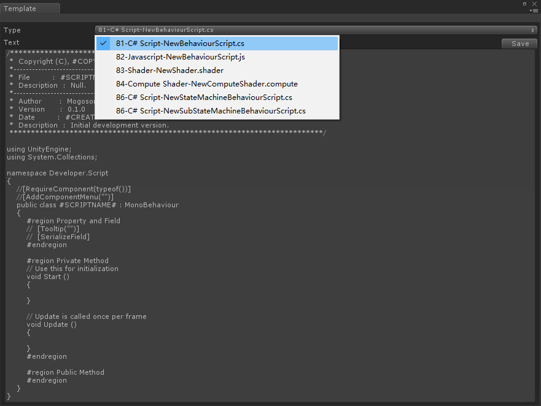
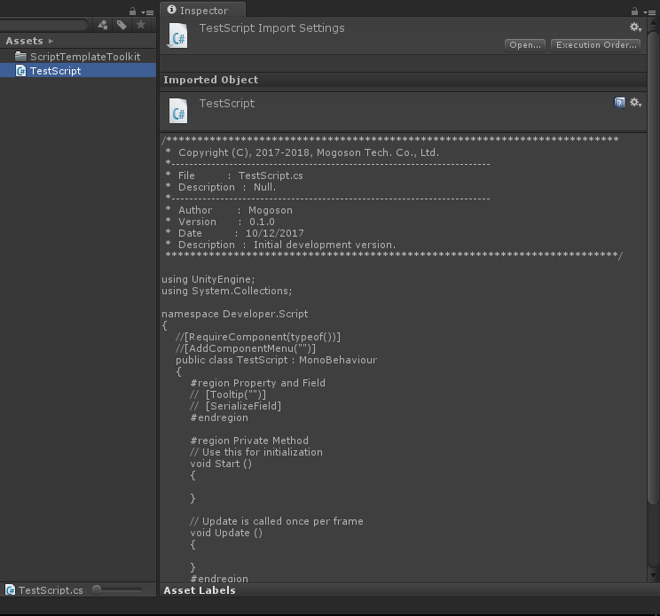

# ScriptTemplateToolkit
- [中文手册](./README_ZH.md)

## Summary
- Toolkit for Unity editor script templates. 

## Demand
- Quickly edit/save Unity editor script templates.
- Auto insert file header comments into the new script.
- Auto mark create time and copyright time.

## Environment
- Unity 5.0 or above.
- .Net Framework 3.0 or above.

## Prerequisite
- In fact, the script templates store under the Unity editor install path,
  example "Unity 5.4.1f1\Editor\Data\Resources\ScriptTemplates".
- Unity provide the API(OnWillCreateAsset method of the AssetModificationProcessor class)
  to capture the event of user create asset(include script) in Unity editor.

## Scheme
### Edit
- Create our own editor code, inherit from EditorWindow class to draw our editor UI,
  and use our editor to edit/save Unity script templates.
- Define mark string, "#CREATETIME#" mark create time of script and "#COPYRIGHTTIME#"
  mark copyright time of code.
- Create your style script templates.

### Create
- When you create a script file in Unity editor Project, Unity engine will copy the
  corresponding template to the new file.
- Create our own extend editor code, inherit from AssetModificationProcessor class and
  achieve the OnWillCreateAsset(string assetPath) method to capture the event of create
  asset(include script), read the new script text and replace the "#CREATETIME#" to current
  date time and replace the "#COPYRIGHTTIME#" to this year-next year.

## Achieve
### Editor
- ScriptTemplateEditor : Read/Edit/Save script tamplates of Unity engine.
- ScriptTemplateModifier : Capture the event of create script and replace the mark string
  to corresponding content.

### Template
- Templates in the path "ScriptTemplateToolkit/Templates" provide reference to you to create
  your style script templates.

## Preview
- ScriptTemplateEditor.

- TestScript.

## Contact
- If you have anny questions, fell free to contact me at mogoson@qq.com.