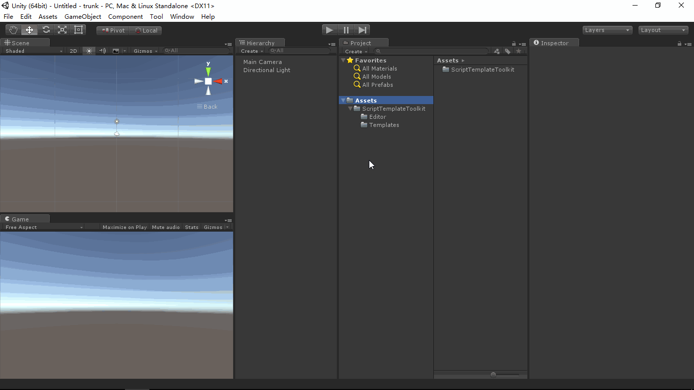

# ScriptTemplateToolkit
- [中文手册](./README_ZH.md)

## Summary
- Toolkit for Unity editor script templates. 

## Demand
- Quickly Edit/Save Unity editor script templates.
- Auto insert file header comments into the new script.
- Auto mark create date and copyright year.

## Environment
- Unity 5.0 or above.
- .Net Framework 3.0 or above.

## Prerequisite
- In fact, the script templates store under the Unity editor install path,
  example "Unity 5.0.0f4\Editor\Data\Resources\ScriptTemplates".
- Unity provide the API(OnWillCreateAsset method of the AssetModificationProcessor class)
  to capture the event of user create asset(include script) in Unity editor.

## Scheme
### Edit
- Create editor code, inherit from EditorWindow class to draw our editor UI,
  and use our editor to Edit/Save Unity script templates.
- Define mark string, "#CREATEDATE#" mark create date of script and "#COPYRIGHTYEAR#"
  mark copyright year of code.
- Create our style script templates.

### Create
- When you create a script file in Unity editor Project, Unity engine will copy the
  corresponding template to the new file.
- Create our editor code, inherit from AssetModificationProcessor class and achieve
  the OnWillCreateAsset(string assetPath) method to capture the event of create
  asset(include script), read the new script text and replace the "#CREATEDATE#" to current
  date and replace the "#COPYRIGHTYEAR#" to current year.

## Achieve
### Editor
- ScriptTemplateEditor : Read/Edit/Save script tamplates of Unity engine.
- ScriptTemplateModifier : Capture the event of create script and replace the mark string
  to corresponding content.

### Template
- Templates in the path "ScriptTemplateToolkit/Templates" provide reference to you to create
  your style script templates.

- The format of copyright statement in the templates reference from the [U.S. Copyright Office](https://www.copyright.gov/).

## Preview
- ScriptTemplateEditor.

## Contact
- If you have any questions, feel free to contact me at mogoson@qq.com.